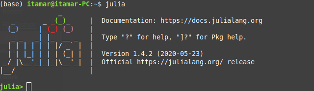

## Julia Implementation

# Setup

* Open Julia on your terminal
```
julia
```
<p align="left">
  
</p>

* Import Pkg
```
import Pkg
```

* Install JuMP
```
Pkg.add("JuMP")
```

* Install GLPK Optimizer
```
Pkg.add("GLPK")
```
# Executing
* execute the file with the path to the instance
```
julia main.jl ../material/questao2.txt
```
