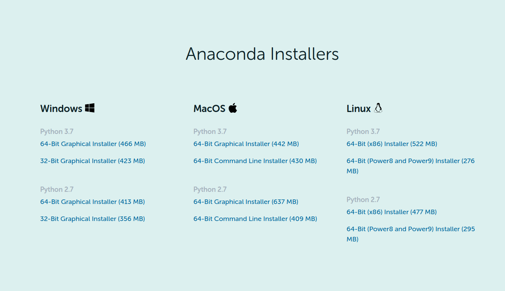

# Assignment implementation using Gurobi


## Requirements

* Download the requirements using   

```
$ pip install -r requirements.txt
```

* Install Gurobi Optimizer with Anaconda, instructions in [Gurobi](#Gurobi)

### Gurobi

* **Step 1: Download and Install Anaconda**

The first step is to download and install Anaconda. You can find detailed instructions [here](https://www.anaconda.com/products/individual). Be sure to check the box ```Add Anaconda to my PATH environment variable``` when prompted during the installation process. Otherwise, Step 2 may not work.

<p align = "center">

</p>

Click on the download button for the version you want. Once the download has been completed, issue the following command in the directory where you have stored the downloaded file:

```
$ bash Anaconda3-2020.02-Linux-x86_64.sh
```

**Note:** After bash write the name of the downloaded file that corresponds to the Anaconda version selected.

Once the install is complete, and once you close your current terminal and open a new one, typing python in your terminal window should invoke the Anaconda Python interpreter:


```
>python
Python 3.7.4 |Anaconda, Inc.|...
...
```

Type ```quit()``` in Python to return to the terminal.

* **Step 2: Install Gurobi into Anaconda**

The next step is to install the Gurobi package into Anaconda. You do this by first adding the Gurobi channel to your Anaconda channels and then installing the gurobi package from this channel.

From a terminal window issue the following command to add the Gurobi channel to your default search list

```
$ conda config --add channels http://conda.anaconda.org/gurobi
```

Now issue the following command to install the Gurobi package

```
$ conda install gurobi
```

You can remove the Gurobi package at any time by issuing the command

```
$ conda remove gurobi
```


* **Step 3: Install a Gurobi License**

The third step is to install a [Gurobi license](https://www.gurobi.com/documentation/9.0/quickstart_linux/retrieving_and_setting_up_.html#section:RetrieveLicense).

You are now ready to use Gurobi from within Anaconda.