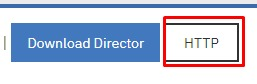

# Operations Research

[](https://www.linkedin.com/in/itamarrocha) 


## Table of Contents
- [Books](#books)
- [Setup](#setup)
- [Code](#code)
- [Clone](#clone)
- [Author](#author)
- [Support](#support)
- [License](#license)
---
## Books
* Introdução à Pesquisa Operaciona (Hiller and lierberman)
* Introduction to linear optimization (Bertsimas)
* Pesquisa Operacional (Arenales)
* Otimização Linear (Maculan-Fampa)
* Operations research aplications and algorithms (Winston)

---
## Setup
In this repository we are using Cplex. Cplex is and IBM software. If you have an institutional email and is currently enroled in a university you can get the student license for free. Make sure to create an account in this <a href="https://my15.digitalexperience.ibm.com/b73a5759-c6a6-4033-ab6b-d9d4f9a6d65b/dxsites/151914d1-03d2-48fe-97d9-d21166848e65/home">site</a> with your institutional email. After setting up an account follow these steps:
* download Cplex in this <a href="https://my15.digitalexperience.ibm.com/b73a5759-c6a6-4033-ab6b-d9d4f9a6d65b/dxsites/151914d1-03d2-48fe-97d9-d21166848e65/technology/data-science">site</a> ( Go to **technology** -> **Data Science** -> **ILOG CPLEX Optimization Studio**)
    * This will open a pop up with the software versions. The one used in this repository is **IBM ILOG CPLEX Optimization Studio V12.10 for Linux x86-64 Multilingual (CC439ML ) [637 MB]**
    * Check the tickbox of the Studio presentend above and then just download it as below. 
<p align="left">
  
</p>

**You may have to use sudo in some of the commands below**
* After downloading, type in your terminal (where the archive is stored):
```shell
chmod +x downloaded_file.bin
```
* Then, execute with sudo:
```shell
./downloaded_file.bin
```
* Agree with the installation terms.
* When testing make sure to check if the version in the makefile checks with the one you have installed.

* You can also install python Cplex. Instructions will come with the folder you have downloaded
---

## Code
Here are listed some of the codes presented in this repository:

* [**Exercise solution list 1 - TEOBALDO (PO)**](https://github.com/ItamarRocha/Operations-Research/tree/master/PO_class/exercises_1)
* [**Bin packing problem**](https://github.com/ItamarRocha/Operations-Research/tree/master/algos/binpacking)
* [**Knapsack 0-1 problem**](https://github.com/ItamarRocha/Operations-Research/tree/master/algos/knapsack-01)
* [**Simple problems implementation**](https://github.com/ItamarRocha/Operations-Research/tree/master/algos/cplex_problems/intro)

> WIP codes
* [**Assignment Problem**](https://github.com/ItamarRocha/Operations-Research/tree/master/algos/assignment_problem)
* [**Simplex algo**](https://github.com/ItamarRocha/Operations-Research/tree/master/algos/simplex)
* [**Map coloring (just hard coded till now)**](https://github.com/ItamarRocha/Operations-Research/tree/master/algos/mapcoloring)
---
## Clone

- Clone this repo to your local machine using
> git clone https://github.com/ItamarRocha/Operations-Research.git

## Author

 <a href="https://www.linkedin.com/in/itamarrocha/" target="_blank">**Itamar Rocha**</a>
:---: 
 </img>
<a href="http://github.com/ItamarRocha" target="_blank">`github.com/ItamarRocha`</a>

---

## Support

Reach out to me at one of the following places!

- Email `itamardprf@gmail.com` 
- Linkedin at <a href="https://www.linkedin.com/in/itamarrocha/" target="_blank">`itamarrocha`</a>

---

## License

[](http://badges.mit-license.org)

- **[MIT license](http://opensource.org/licenses/mit-license.php)**

